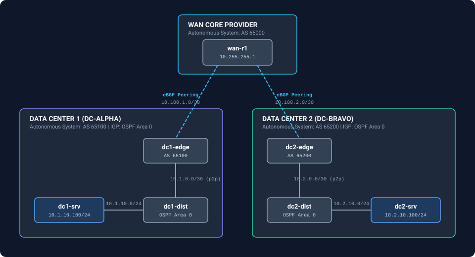
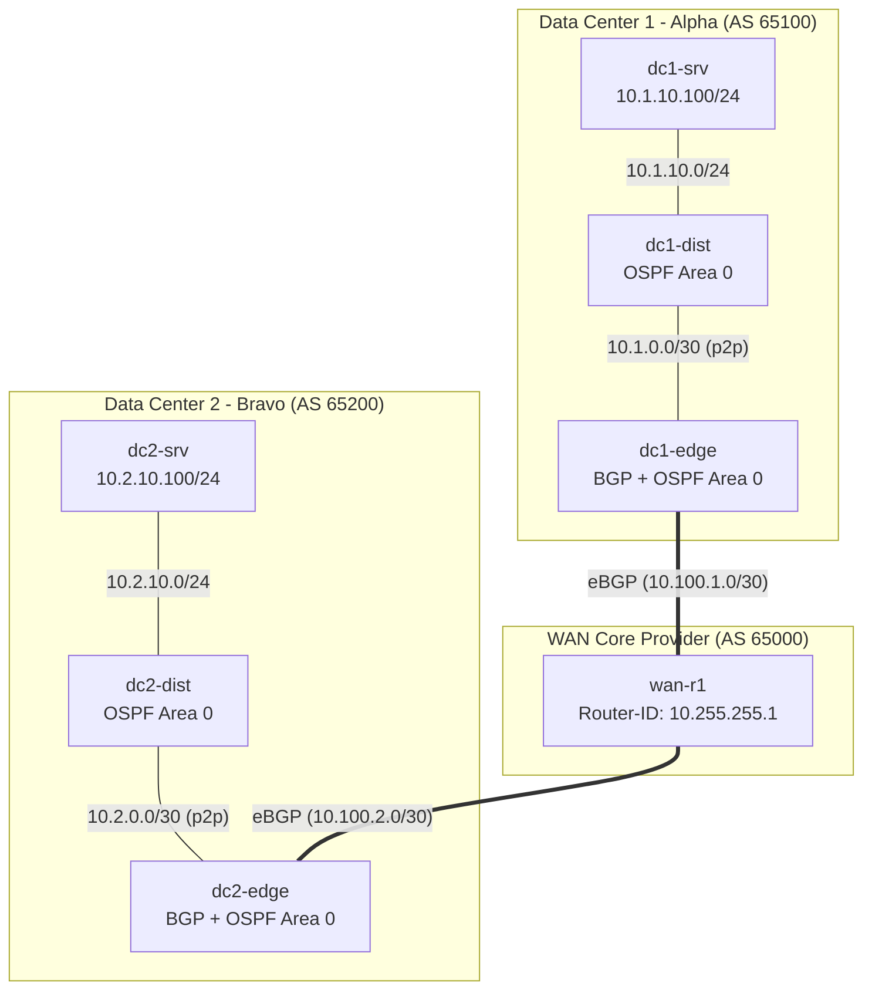

# NetDevOps Network Topologies with Containerlab & Docker

Repository containing declarative network topologies, configurations, and automated validation tests for NetDevOps laboratories using Containerlab and Docker.

---

## Network Architecture Overview

Below is the architecture for the Enterprise Multi-Site WAN topology (`labs/04-enterprise-multisite-bgp-ospf`):





---

## Directory Structure

```text
.
├── Makefile                      # Automation targets for lab lifecycle management
├── .gitignore                    # Ignore rules for clab artifacts and vendor images
├── docs/                         # Architecture diagrams and documentation assets
│   └── topology.svg
├── images/                       # Documentation on managing vendor NOS images
│   └── README.md
├── tests/                        # Automated validation test suites
│   └── verify-enterprise-wan.sh
└── labs/
    ├── 01-frr-ospf/              # Starter lab: 2 FRR routers with OSPF and Alpine hosts
    │   ├── config/
    │   └── frr-ospf.clab.yml
    ├── 02-srlinux-leafspine/     # Clos Fabric template with Nokia SR Linux
    │   └── srlinux-clos.clab.yml
    ├── 03-arista-ceos/           # Switching template for Arista cEOS
    │   └── ceos-lab.clab.yml
    └── 04-enterprise-multisite-bgp-ospf/ # Flagship: Multi-Site WAN with BGP + OSPF
        ├── config/
        ├── multisite-enterprise.clab.yml
        └── README.md
```

---

## Quickstart

### Prerequisites

- Linux (Ubuntu 22.04 or WSL2)
- Docker Engine
- Containerlab (>= 0.50.0)

### Clone Repository

```bash
git clone https://github.com/Bryann288/netdevops-containerlab-labs.git
cd netdevops-containerlab-labs
```

### Deploying Topologies

Deploy the Enterprise Multi-Site WAN lab:

```bash
make deploy-enterprise
```

Or deploy directly via containerlab CLI:

```bash
sudo containerlab deploy -t labs/04-enterprise-multisite-bgp-ospf/multisite-enterprise.clab.yml --reconfigure
```

---

## Automated Verification

The repository includes end-to-end automated test suites to validate routing protocols, state convergence, and data plane forwarding:

```bash
make verify-enterprise
```

### Verification Checks Performed:
1. **Container State**: Validates all 7 nodes are running.
2. **BGP Sessions**: Confirms eBGP peering on `wan-r1` across AS 65000, AS 65100, and AS 65200.
3. **OSPF Adjacencies**: Verifies point-to-point adjacency state is `Full` inside DC1 and DC2.
4. **Data Plane Reachability**: Validates end-to-end ICMP ping between `dc1-srv` (10.1.10.100) and `dc2-srv` (10.2.10.100) with 0% packet loss.
5. **Path Traceability**: Runs traceroute across the 6-hop path (`dc1-srv -> dc1-dist -> dc1-edge -> wan-r1 -> dc2-edge -> dc2-dist -> dc2-srv`).

---

## Topology Visualization

Containerlab provides a built-in web server to explore the topology interactively:

```bash
make graph LAB=labs/04-enterprise-multisite-bgp-ospf/multisite-enterprise.clab.yml
```

Open `http://localhost:50080` in your web browser.

---

## Lifecycle Commands

| Target | Description |
| :--- | :--- |
| `make deploy-enterprise` | Deploy Enterprise Multi-Site WAN topology |
| `make verify-enterprise` | Run automated validation tests |
| `make destroy-enterprise` | Destroy Enterprise lab and clean up network interfaces |
| `make deploy LAB=<path>` | Deploy custom topology file |
| `make destroy LAB=<path>` | Destroy custom topology file |
| `make inspect LAB=<path>` | Display node details, IP assignments, and status |
| `make graph LAB=<path>` | Launch interactive browser visualization |
| `make clean` | Remove runtime `clab-*` temporary directories |
