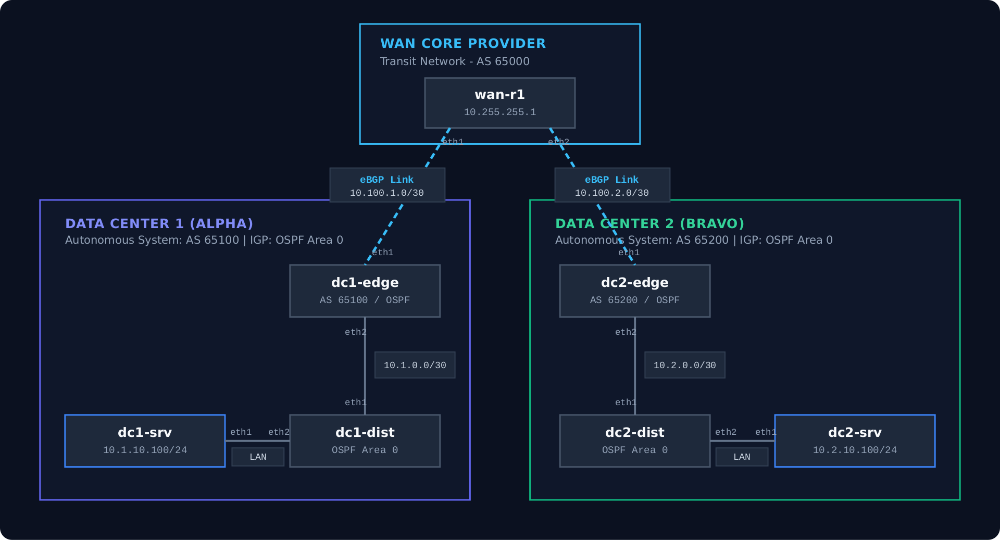
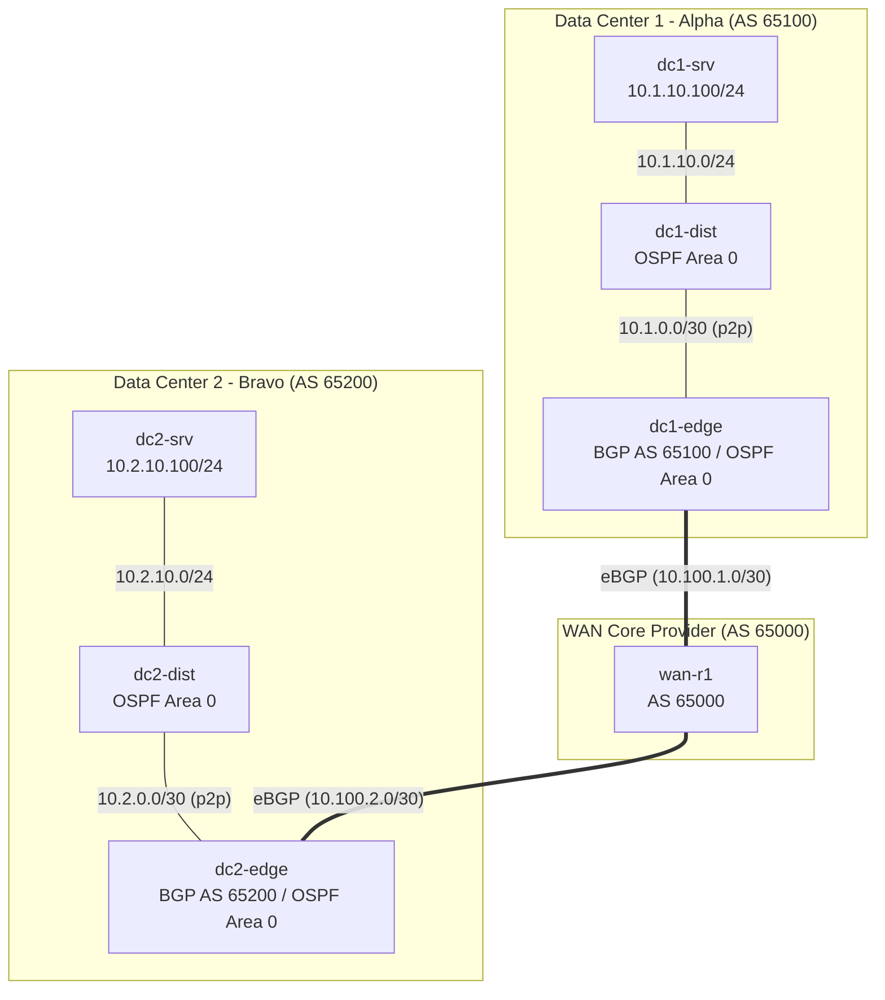

# Enterprise Multi-Site WAN with BGP & OSPF

This laboratory emulates a multi-site enterprise network consisting of two data center locations (DC-Alpha and DC-Bravo) interconnected through a service provider WAN core.

---

## Topology Diagram

---

## IP Addressing and Routing Scheme

| Device | Interface | IP Address | Protocol / Role |
| :--- | :--- | :--- | :--- |
| **wan-r1** | `eth1` | `10.100.1.1/30` | eBGP peering to DC1-Edge (AS 65000 <-> 65100) |
| | `eth2` | `10.100.2.1/30` | eBGP peering to DC2-Edge (AS 65000 <-> 65200) |
| **dc1-edge** | `eth1` | `10.100.1.2/30` | eBGP uplink to WAN-R1 |
| | `eth2` | `10.1.0.1/30` | OSPF Area 0 point-to-point peering to DC1-Dist |
| **dc1-dist** | `eth1` | `10.1.0.2/30` | OSPF Area 0 point-to-point peering to DC1-Edge |
| | `eth2` | `10.1.10.1/24` | Default gateway for DC1 servers |
| **dc1-srv** | `eth1` | `10.1.10.100/24` | Application server (Default Gateway: 10.1.10.1) |
| **dc2-edge** | `eth1` | `10.100.2.2/30` | eBGP uplink to WAN-R1 |
| | `eth2` | `10.2.0.1/30` | OSPF Area 0 point-to-point peering to DC2-Dist |
| **dc2-dist** | `eth1` | `10.2.0.2/30` | OSPF Area 0 point-to-point peering to DC2-Edge |
| | `eth2` | `10.2.10.1/24` | Default gateway for DC2 servers |
| **dc2-srv** | `eth1` | `10.2.10.100/24` | Application server (Default Gateway: 10.2.10.1) |

---

## Design Highlights

1. **Autonomous System Design:** Each Data Center is provisioned under an independent 2-byte private Autonomous System (`65100` and `65200`). The WAN Core operates under transit AS `65000`.
2. **Fast IGP Convergence:** OSPF is configured as `network point-to-point` on all `/30` links, eliminating DR/BDR election overhead and achieving sub-second adjacency establishment.
3. **Route Redistribution:** Edge routers redistribute internal OSPF prefixes into BGP (`redistribute ospf`) and remote BGP prefixes into internal OSPF (`redistribute bgp`). This guarantees specific `/24` route propagation and prevents traffic misdirection.
4. **Automated Verification:** The lab includes an automated validation script (`tests/verify-enterprise-wan.sh`) checking protocol status, routing tables, and end-to-end data plane forwarding.
