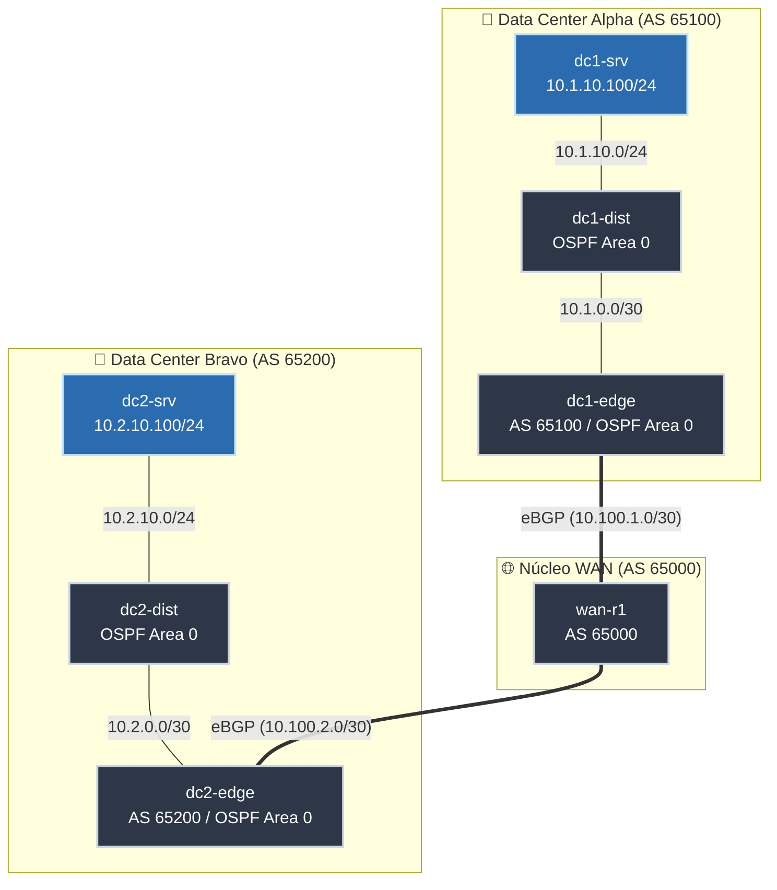

# Laboratorio Enterprise Multi-Site WAN con BGP & OSPF 🏢🌐

Este laboratorio emula la arquitectura de una empresa multinacional o con dos centros de datos (**DC-Alpha** y **DC-Bravo**) interconectados a través de un proveedor de servicios o núcleo WAN (**WAN-Core**).

---

## 📐 Topología y Diagrama de Red

---

## 📊 Plan de Direccionamiento IP y Enrutamiento

| Dispositivo | Interfaz | Dirección IP | Función / Protocolo |
| :--- | :--- | :--- | :--- |
| **wan-r1** | `eth1` | `10.100.1.1/30` | eBGP Peering con DC1-Edge (AS 65000 <-> 65100) |
| | `eth2` | `10.100.2.1/30` | eBGP Peering con DC2-Edge (AS 65000 <-> 65200) |
| **dc1-edge** | `eth1` | `10.100.1.2/30` | eBGP Uplink a WAN-R1 |
| | `eth2` | `10.1.0.1/30` | OSPF Area 0 con DC1-Dist (Origina ruta default) |
| **dc1-dist** | `eth1` | `10.1.0.2/30` | OSPF Area 0 con DC1-Edge |
| | `eth2` | `10.1.10.1/24` | Gateway LAN para Servidores DC1 |
| **dc1-srv** | `eth1` | `10.1.10.100/24` | Servidor aplicación DC1 (GW: 10.1.10.1) |
| **dc2-edge** | `eth1` | `10.100.2.2/30` | eBGP Uplink a WAN-R1 |
| | `eth2` | `10.2.0.1/30` | OSPF Area 0 con DC2-Dist (Origina ruta default) |
| **dc2-dist** | `eth1` | `10.2.0.2/30` | OSPF Area 0 con DC2-Edge |
| | `eth2` | `10.2.10.1/24` | Gateway LAN para Servidores DC2 |
| **dc2-srv** | `eth1` | `10.2.10.100/24` | Servidor aplicación DC2 (GW: 10.2.10.1) |

---

## ⚙️ Principios de Arquitectura Implementados

1. **Segmentación de AS (Sistemas Autónomos):** Cada Datacenter actúa como un AS privado independiente (`65100` y `65200`), mientras que el núcleo WAN actúa como proveedor de tránsito (`65000`).
2. **IGP Interno (OSPF):** Cada Datacenter ejecuta internamente OSPF en Área 0 para máxima velocidad de convergencia y aislamiento de fallos internos.
3. **Redistribución de Rutas:** Los routers de borde (`dc1-edge` y `dc2-edge`) anuncian sus prefijos internos OSPF hacia la WAN mediante BGP, e inyectan una ruta predeterminada hacia el interior del Datacenter.
4. **Validación Automatizada:** El script `tests/verify-enterprise-wan.sh` comprueba de forma automática BGP, OSPF, tablas de enrutamiento, ping de datos y trazabilidad de 6 saltos.
